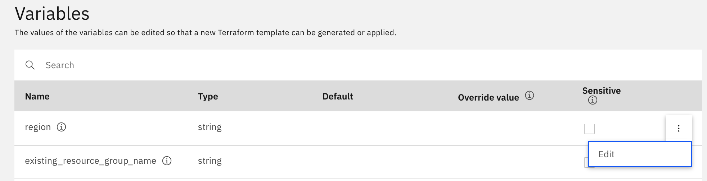

# IBM Cloud VPC Fortigate VNF Lab

This repository contains Terraform code to create a lab for testing the IBM Cloud Fortigate VNF offering.


The deployment has 2 supported deployment models:

- [Run Terraform locally](#deploy-with-terraform-locally)
- [IBM Cloud Schematics](#deploy-with-ibm-cloud-schematics)

## Variables

List of required and optional variables for the lab environment:

| Name | Description | Type | Default | Required |
|------|-------------|------|---------|:--------:|
| ibmcloud\_api\_key | IBM Cloud API Key to use for the Terraform deployment. | `string` | n/a | yes |
| region | Name that will be prepended to all deployed resources and used as a project tag. | `string` | n/a | yes |
| project\_prefix | Name that will be prepended to all deployed resources and used as a project tag. | `string` | n/a | yes |
| existing\_cos\_instance | Name of an existing COS instance to use for Flowlog buckets. If no existing COS instance is provided, a new standard COS instance will be deployed. | `string` | n/a | no |
| existing\_resource\_group\_name | Name of an existing Resource Group to associate with the deployed instances. If none provided, a new one will be created. | `string` | n/a | no |
| existing\_vpc\_name | Name of an existing VPC. If none provided, a new one will be created. | `string` | n/a | no |
| existing\_ssh\_key\_name | Name of an existing SSH Key to associate with the deployed instances. If none provided, a new one will be created. | `string` | n/a | no |
| existing\_port1_subnet\_name | Name of an existing VPC subnet to use for Port 1 (public) of the Fortigate VNF instance. If no existing subnet is provided, one is created for Port 1 on the VNF. | `string` | n/a | no |
| existing\_port2_subnet\_name | Name of an existing VPC subnet to use for Port 2 (private) of the Fortigate VNF instance. If no existing subnet is provided, one is created for Port 1 on the VNF. | `string` | n/a | no |
| tags | Tags to add to all deployed resources | `string` | `deployed_from:terraform` | no |

## Outputs

| Name | Description |
|------|-------------|
| vpc\_id | ID of the deployed VPC |
| Fortigate\_Public\_IP | Public Floating IP for the Fortigate VNF instance. |
| vm1\_private\_ip\_address| Private IP for VM 1 |
| vm2\_private\_ip\_address | Private IP for VM 2 | 
| List\_Routing\_Tables\_For\_VPC | Command to list all the routing tables for the deployed VPC | 
| fortigate\_port1\_collector\_bucket | Bucket name for Fortigate VNF Port 1 interface flowlog collector |
| fortigate\_port2\_collector\_bucket | Bucket name for Fortigate VNF Port 2 interface flowlog collector |
| vm1\_subnet\_collector\_bucket | Bucket name for VM 1 Subnet flowlog collector |
| vm2\_subnet\_collector\_bucket | Bucket name for VM 2 Subnet flowlog collector |

---

### Deploy with Terraform locally


#### 1. Clone project repository and target this branch

```sh
git clone https://github.com/cloud-design-dev/ibmcloud-vpc-fortigate-terraform.git
cd ibmcloud-vpc-fortigate-terraform
```

#### 2. Copy `terraform.tfvars.example` to `terraform.tfvars`

```sh
cp terraform.tfvars.example terraform.tfvars
```

#### 3. Edit `terraform.tfvars` to match your environment. 

See [variables](#variables) listed below for available options.

#### 4. Plan deployment

Intitialize the terraform environment and generate a plan:

```sh
terraform init 
terraform plan -out default.tfplan
```

#### 5. Apply Terraform plan

If your plan was generated successfully, you can apply it to deploy the lab resources.

```sh
terraform apply default.tfplan
```

After the resources are created, you should see (similar) terraform output with details about your environment:

```shell
fortigate_admin_password = "xxx-xxxxxx-xxxx-x-xxxxx"
fortigate_admin_username = "admin"
fortigate_port1_collector_bucket = "ftg-vnf-v4-eu-de-fortiage-port-1-flowlogs-collector-bucket"
fortigate_port2_collector_bucket = "ftg-vnf-v4-eu-de-fortiage-port-2-flowlogs-collector-bucket"
fortigate_vnf_public_ip = "149.x.x."
vm1_private_ip_address = "10.243.1.4"
vm1_subnet_collector_bucket = "ftg-vnf-v4-eu-de-vm1-subnet-flowlogs-collector-bucket"
vm2_private_ip_address = "10.243.1.5"
vm2_subnet_collector_bucket = "ftg-vnf-v4-eu-de-vm2-subnet-flowlogs-collector-bucket"
```

### Deploy with IBM Cloud Schematics 

Click the following link to deploy the resources using the IBM Cloud Schematics platform: [:beginner: Deploy using IBM Cloud Schematics](https://cloud.ibm.com/schematics/workspaces/create?repository=https://github.com/cloud-design-dev/ibmcloud-vpc-fortigate-terraform/tree/existing-vpc&terraform_version=terraform_v1.0&workspace_name=fortigate-vnf-lab-workspace)

#### 1. Finish configuring Schematics workspace

You will need to provide the following information to complete the creation of the Schematics Workspace:

- (**Required**) Resource Group to be used for the Schematics workspace. This does not have to match the Resource Group used for the Fortigate lab resources.
- (**Required**) Select Location where the Schematics Workspace actions will be executed. This does not have to match the Location where the Fortigate lab resources will be deployed.
- (**Optional**) Tags that will be added to the Schematics Workspace.
- (**Optional**) A description for the Schematics Workspaces.


#### 2. Configure Schematics workspace variables

After the Workspace is created, you will need to set the required variables. See [variables](#variables) listed above for available options.



#### 3. Generate a Schematics workspace plan

Once you have all your variables set, you can generate a Workspace (Terraform) plan action. The plan action will determine what items need to be created, updated, or destroyed based upon the currently configured variables.


#### 4. Apply Schematics workspace plan

If plan is successfully generated you can Apply the plan to deploy the lab resources.


